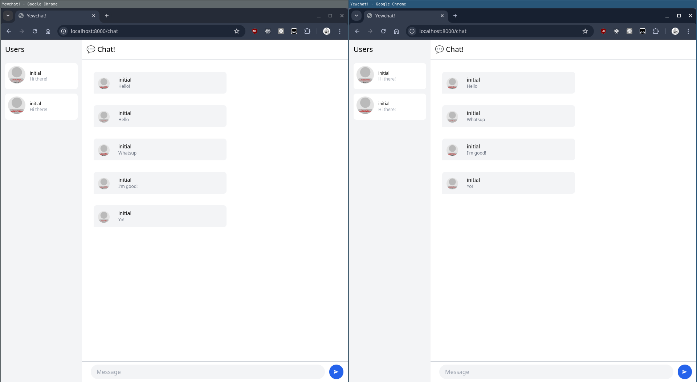
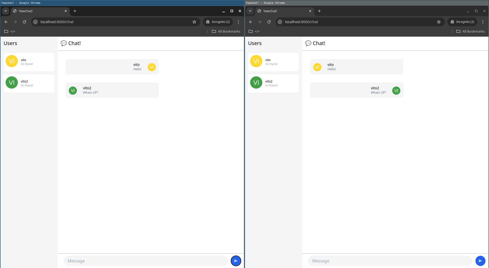

[Original Work](https://github.com/jtordgeman/YewChat)

---

#### Experiment 3.1: Original Code

---

#### Experiment 3.2: Be Creative

I added some UI changes so that the current user's messages is right aligned instead of left aligned.

